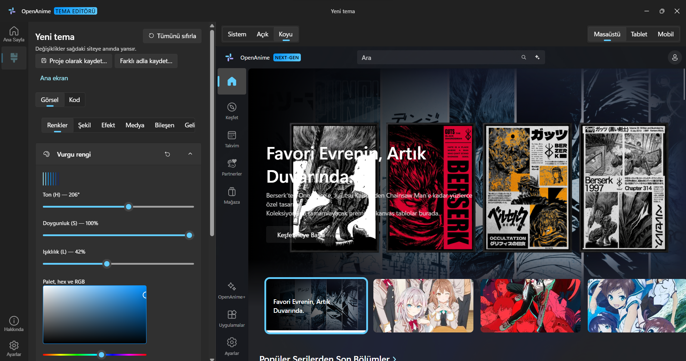
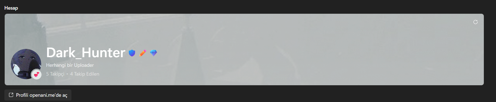
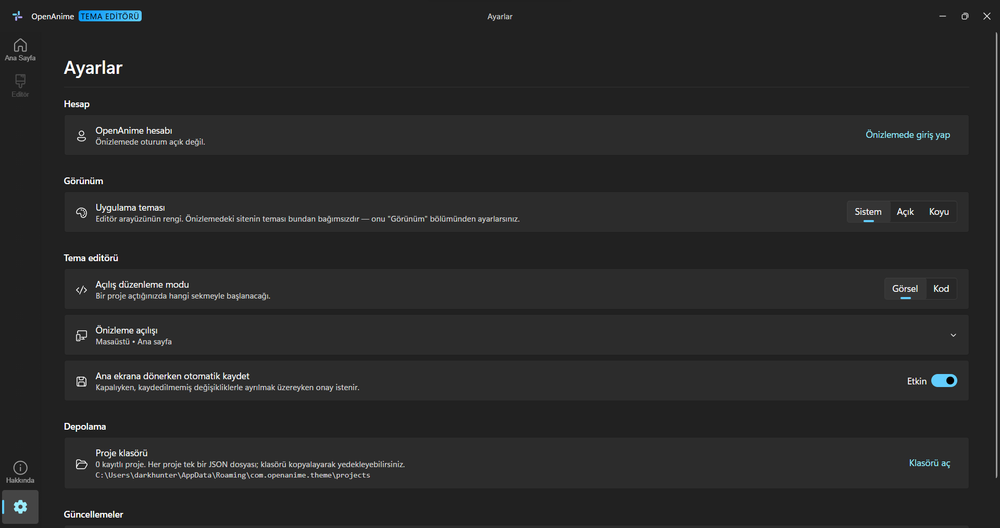
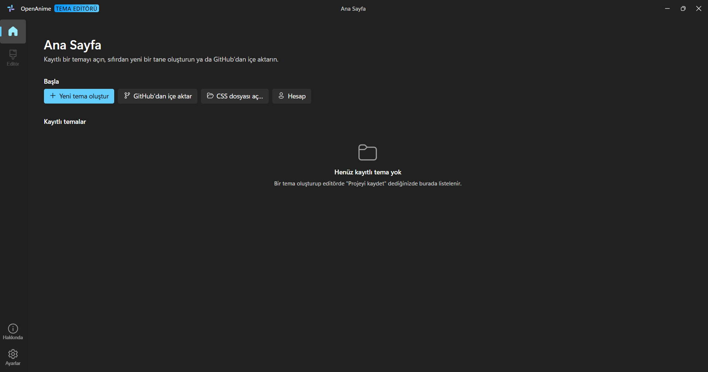
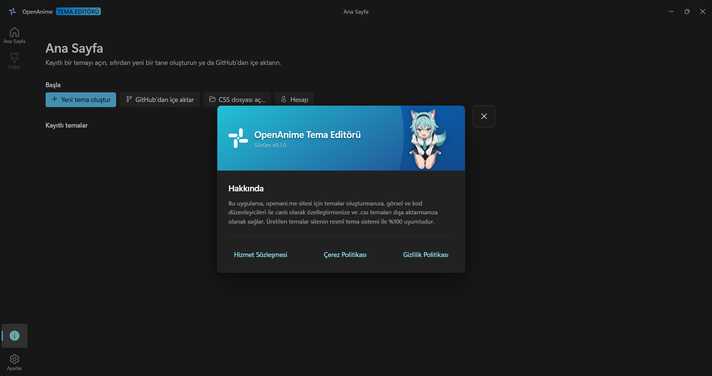

<div align="center">


# OpenAnime Tema Editörü

**[openani.me](https://openani.me) için canlı önizlemeli, görsel bir masaüstü tema editörü.**

<br/>


[](./LICENSE)

</div>

---

<div align="center">

<br/><sub>Sol panel: görsel kontroller / kod editörü · Sağ panel: openani.me'nin canlı önizlemesi</sub>
</div>

---

## &nbsp; Proje Hakkında

Bu depo, **[openani.me](https://openani.me)** için resmî olmayan bir masaüstü tema editörüdür. Sitenin kendi tema enjeksiyon noktasını (`localStorage.theme_content`) kullanarak, sitenin gerçek CSS'ini ve `fluent-svelte-extra` tasarım dilini birebir okuyup düzenlemenize izin verir.

Uygulama tahmine değil, **doğrulanmış bulgulara** dayanır: her `--fds-*` token, her seçici ve her API yanıtı, sitenin canlı CSS/JS paketleri incelenerek teyit edilmiştir (bkz. [`PLAN.md`](./PLAN.md), [`TEMA-BULGULARI.md`](./TEMA-BULGULARI.md)). Üretilen `.css` dosyası, ekstra bir adım gerektirmeden sitenin kendi resmî tema sistemiyle **%100 uyumludur**.

> [!NOTE]
> Bu proje topluluk tarafından geliştirilmektedir, OpenAnime'ın resmî bir ürünü değildir.

---

## &nbsp; Öne Çıkan Özellikler

### &nbsp; Canlı Önizlemeli Görsel Editör

- Editör ekranı iki panelden oluşur: solda kategorilere ayrılmış görsel kontroller (Renkler, Şekil, Efekt, Medya, Bileşen, Gelişmiş), sağda **openani.me'nin gerçek kendisinin** çalıştığı, native bir webview.
- Her kontrol değişikliği anında sağdaki önizlemeye yansır — ayrı bir "uygula" adımı yoktur.
- Önizleme, sitenin masaüstü/tablet/mobil kırılma noktalarını **gerçekten** tetikleyecek şekilde daraltılabilir; sahte bir CSS ölçeklemesi değildir.

### &nbsp; İki Yönlü Kod Editörü

- Görsel kontrollerle aynı belge üzerinde çalışan bir CodeMirror tabanlı CSS editörü — birini değiştirmek diğerini günceller.
- Otomatik tamamlama kataloğu (`bun run catalog`) hem `fluent-svelte-extra`'nın kendi `theme.css`/`switchable.css` dosyalarından hem de sitenin canlı bundle'larından **otomatik üretilir**; elle bakım gerekmez.

### &nbsp; İçe/Dışa Aktarma

- Bir GitHub deposundan `.css` tema dosyası doğrudan içe aktarılabilir.
- Yerel bir `.css` dosyası açılıp düzenlenebilir, aynı dosyaya geri yazılabilir.
- Tanınmayan/yabancı bir CSS bile ayrıştırılıp kontrollere olabildiğince eşlenir.

### &nbsp; Yerel Proje Sistemi

- Temalar `app_data_dir()/projects/` altında, proje başına tek bir JSON dosyası olarak saklanır — klasörü kopyalayarak yedeklemek yeterlidir.
- Kaydedilen belge (`doc`) ile görsel kontrollerin durumu (`ui`) ayrı tutulur; bir bölümün kapalı olması ile açık-ama-varsayılan olması aynı CSS'i üretir, bu ayrım olmadan projeyi geri yüklediğinizde kontroller sıfırlanmış görünürdü.

### &nbsp; Hesap Kartı

<div align="center">

</div>

- Önizlemede giriş yaptıysanız Ayarlar sayfasında **gerçek openani.me profiliniz** — banner, avatar, durum emojisi, rozetleriniz (Yönetici, Fansub Yöneticisi, Geliştirici, Erken Destekçi, OpenAnime+ kademeleri) ve takipçi/takip edilen sayınız — sitenin kendi profil sayfasıyla aynı düzende gösterilir.
- Takipçi/takip edilen sayılarına tıklayarak listeyi açabilir, "Profili openani.me'de aç" ile gerçek profil sayfasını sistem tarayıcınızda açabilirsiniz.
- Hesap verisi, uygulamanın kendi ağ isteği atmasıyla DEĞİL, önizlemedeki oturumunuzun kendi güvenlik geçidi üzerinden çekilir — token uygulamaya hiç dokunmaz.

### &nbsp; Ekrana Akıllıca Sığan Pencere

- Açılışta, birincil ekranınızın kullanılabilir alanı ölçülür; pencere bu alana sığmıyorsa (ör. küçük dizüstü ekranları) otomatik olarak küçültülüp ortalanır — görev çubuğunun altında kalmaz.

### &nbsp; Uygulamanın Kendi Ayarları

<div align="center">

</div>

Düzenlediğiniz temayı **etkilemeyen**, yalnızca editörün kendi davranışına dair tercihler: açılış düzenleme modu (görsel/kod), varsayılan önizleme genişliği ve sayfası, ana ekrana dönerken otomatik kaydetme.

### &nbsp; Uygulama İçi Güncelleyici

- Açılıştan birkaç saniye sonra arka planda sessizce yeni sürüm kontrolü yapılır; bulunursa aynı diyalog şablonuyla (bkz. "Hakkında" penceresi) sürüm notları, indirme ilerlemesi ve "İndir ve Kur" / "Daha Sonra Hatırlat" seçenekleri gösterilir.
- **Üç yayın kanalı:** *Stable*, *Beta*, *Alpha*. Her kanalın depoda AYRI bir manifesti var (`updater/latest-<kanal>.json`) ve yayın iş akışı yalnızca kendi kanalının dosyasını günceller. Stable kanalı seçen kullanıcıya ön-sürüm **hiçbir koşulda** sunulmaz — filtre istemcide değil, hangi dosyanın okunduğunda.
- Seçili kanaldan henüz yayın yapılmamışsa bu ayrı bir durum olarak gösterilir ("… kanalında yayınlanmış sürüm yok"), "güncelsin" denmez.
- Güncellemeler [`tauri-plugin-updater`](https://v2.tauri.app/plugin/updater/) ile **imzalı** olarak dağıtılır ve indirilmeden önce doğrulanır; kurulum bitince uygulama kendini yeniden başlatır.
- Otomatik kontrol Ayarlar'dan kapatılabilir; kanal seçimi ve elle kontrol de aynı sayfada.

---

## &nbsp; Diğer Ekranlar

<table>
<tr>
<td width="50%" align="center">

<sub>Ana sayfa — kayıtlı projeler, yeni tema / GitHub'dan içe aktarma</sub>
</td>
<td width="50%" align="center">

<sub>Hakkında penceresi</sub>
</td>
</tr>
</table>

---

## &nbsp; Kurulum

[Releases](https://github.com/Dark-Hunter-TR/OpenAnime-Thema/releases) sekmesinden hazır bir sürüm indirebilir, ya da aşağıdaki adımlarla kaynaktan derleyebilirsiniz. Her yayında üç platform da otomatik derlenip yayınlanıyor:

| Platform | Paket | Not |
| --- | --- | --- |
| **Windows** (x64) | `.exe` (NSIS kurulumu) | Geliştirildi ve test edildi |
| **macOS** (Apple Silicon + Intel) | `.dmg` / `.app` | Tek `universal` paket ikisini de kapsar |
| **Linux** (x64) | `.AppImage`, `.deb` | AppImage medya çerçevesiyle birlikte paketlenir |

> **macOS notu:** paketler Apple tarafından imzalanıp notarize edilmediği için ilk açılışta Gatekeeper uyarı verir. Uygulamaya sağ tıklayıp **Aç** demek ya da *Sistem Ayarları → Gizlilik ve Güvenlik* altından izin vermek yeterli. Güncelleme imzası (minisign) bundan bağımsız ve her platformda doğrulanıyor.
>
> **Linux notu:** `.deb` için WebKitGTK 4.1 gerekir (`libwebkit2gtk-4.1-0`). AppImage'ı çalıştırmadan önce `chmod +x` vermeyi unutmayın.

---

## &nbsp; Kaynaktan Derleme

### 1. Ön Gereksinimler

- [Rust](https://www.rust-lang.org/tools/install) (Tauri çekirdeği için)
- [Bun](https://bun.sh/) *(önerilen)* veya [Node.js/npm](https://nodejs.org/)
- Tauri v2 sistem bağımlılıkları — bkz. [Tauri Ön Gereksinimleri](https://tauri.app/start/prerequisites/)
  - **Windows:** WebView2 Runtime (Windows 11'de kurulu gelir) + MSVC derleme araçları
  - **macOS:** Xcode Command Line Tools. `universal` paket için iki hedef de gerekir:
    `rustup target add aarch64-apple-darwin x86_64-apple-darwin`
  - **Linux:** WebKitGTK **4.1** ve paketleme araçları:
    ```bash
    sudo apt install libwebkit2gtk-4.1-dev libjavascriptcoregtk-4.1-dev       libsoup-3.0-dev libappindicator3-dev librsvg2-dev libxdo-dev       libssl-dev build-essential patchelf file wget
    ```

### 2. Klonla & Çalıştır

```bash
git clone https://github.com/Dark-Hunter-TR/OpenAnime-Thema.git
cd OpenAnime-Thema

# Bağımlılıkları yükle
bun install        # veya: npm install

# Geliştirici modunda başlat (native pencere + hot reload)
bun run tauri dev  # veya: npm run tauri dev
```

> Yalnızca arayüz kabuğunu tarayıcıda çalıştırmak için `bun run dev` yeterlidir; ancak önizleme webview'i ve dosya sistemi komutları gibi native özellikler için `tauri dev` gerekir.

### 3. Yerel Paketleme (Build)

```bash
bun run build:test      # imzasız — "derleniyor mu" sorusunun cevabı
bun run build:release   # imzalı; TAURI_SIGNING_PRIVATE_KEY şart
```

Çıktı `src-tauri/target/release/bundle/` altında, platforma göre:

| Platform | Klasör | Not |
| --- | --- | --- |
| Windows | `nsis/` | Özel NSIS kurulumu; MSI üretilmiyor |
| macOS | `dmg/`, `macos/` | `--target universal-apple-darwin` ile derlenirse `target/universal-apple-darwin/release/bundle/` altında |
| Linux | `appimage/`, `deb/` | |

Hedefler platform başına `src-tauri/tauri.<platform>.conf.json` dosyalarında; taban `tauri.conf.json` yalnızca ortak ayarları taşıyor. Tauri bu dosyaları derleme hedefine göre kendiliğinden bindiriyor.

`build:release` imzalama anahtarı olmadan **"A public key has been found, but no private key"** ile durur: `tauri.conf.json` bir updater pubkey'i içerdiği ve `createUpdaterArtifacts` açık olduğu için bundler imza arar. Yerelde imzalı paket üretmek gerekirse:

```bash
export TAURI_SIGNING_PRIVATE_KEY="$(cat ~/.tauri/openanime-updater.key)"
export TAURI_SIGNING_PRIVATE_KEY_PASSWORD=""   # anahtar parolasızsa boş
```

Yalnızca derlemenin geçtiğini görmek istiyorsanız `build:test` yeterli — o, updater artifact üretimini kapatan `src-tauri/tauri.test.conf.json` ile derler ve hiçbir anahtar istemez.

### 4. Diğer Komutlar

| Komut | Açıklama |
| --- | --- |
| `bun run check` | Svelte + TypeScript tip kontrolü |
| `bun test src` | Birim testleri çalıştırır |
| `bun run catalog` | Kod editörünün otomatik tamamlama kataloğunu, `fluent-svelte-extra` ve sitenin canlı bundle'larından yeniden üretir |
| `bun run set-version 0.2.0` | Sürümü `package.json`, `tauri.conf.json`, `Cargo.toml` ve `Cargo.lock`'ta tek seferde günceller (`0.2.0-alpha.1` / `0.2.0-beta.1` de kabul edilir) |
| `cargo test` *(src-tauri içinde)* | Rust tarafındaki tema ayrıştırma/üretme testleri |

---

## &nbsp; Yayın Süreci *(bakım yapanlar için)*

`.github/workflows/release.yml`, bir `vX.Y.Z` tag'i push edildiğinde (ya da Actions arayüzünden elle) Windows, macOS ve Linux derlemelerini **paralel** alıp GitHub Releases'e **imzalı** olarak yayınlar. `.github/workflows/test-build.yml` ise bir release oluşturmadan yalnızca derlemenin geçtiğini doğrulamak için elle tetiklenir; orada tek bir platform da seçilebilir.

Updater manifesti (`latest.json`) release varlıklarından `scripts/build-updater-manifest.sh` ile **yeniden kuruluyor**. Sebebi: `tauri-action` her derleme işinde kendi `latest.json`'unu yükliyor ve üç iş paralel koştuğu için son biten diğerlerini eziyordu — geriye tek platformluk bir manifest kalıyor, diğer iki platform hiç güncelleme görmüyordu.

**Kanal, tag'in son ekinden türetilir:**

| Tag | Kanal | GitHub'da |
| --- | --- | --- |
| `v0.2.0` | `stable` | normal release |
| `v0.2.0-beta.1` | `beta` | pre-release |
| `v0.2.0-alpha.1` | `alpha` | pre-release |

Actions arayüzünden elle tetiklerken **kanal** ve **baz sürüm** (ör. `0.2.0`) seçilir; ön-sürüm sayacı (`beta.1`, `beta.2` …) mevcut tag'lere bakılarak otomatik artar, elle numara girilmez.

İş akışının sırası: sürüm alanlarını yaz (`scripts/set-version.mjs`) → derle → taslak release → `latest.json` üretildi mi doğrula → taslağı yayınla → `updater/latest-<kanal>.json` dosyasını `main`'e commit'le. Son adım kanal ayrımının tamamı: uygulama o dosyayı okuyor.

İmzalama için depo secret'larına ihtiyaç var (**Settings → Secrets and variables → Actions**):

| Secret | Açıklama |
| --- | --- |
| `TAURI_SIGNING_PRIVATE_KEY` | `tauri signer generate` ile üretilen private key dosyasının içeriği |
| `TAURI_SIGNING_PRIVATE_KEY_PASSWORD` | O anahtarın parolası |

Uygulama içindeki güncelleyici `raw.githubusercontent.com/.../main/updater/latest-<kanal>.json` dosyasını okur (bkz. `src-tauri/src/updater.rs`). Yayın tamamlandığında manifest `main`'e commit'lendiği için güncelleme, yalnızca o kanaldaki kullanıcılara ve bir sonraki kontrolde görünür.

> `tauri.conf.json` içindeki `pubkey` ile secret'taki private key AYNI çifte ait olmalı. Uyuşmazsa derleme sorunsuz geçer ama kullanıcı tarafında imza doğrulaması başarısız olur ve güncelleme kurulmaz.

---

## &nbsp; Mimari Genel Bakış

| Katman | Konum | Sorumluluk |
| --- | --- | --- |
| **Native Çekirdek** | `src-tauri/src/*.rs` | Pencere yönetimi, tema ayrıştırma/üretme (`theme/`), proje kalıcılığı (`projects.rs`), önizleme webview'i ve hesap köprüsü (`preview.rs`) |
| **Önizleme Köprüsü** | `src-tauri/src/preview_init.js` | Önizleme webview'ine enjekte edilen betik — tema uygulama ve openani.me'nin kendi oturumu üzerinden hesap verisi çekme |
| **SvelteKit Arayüzü** | `src/` | Editör, ayarlar, ana ekran ve tüm görsel kontroller |
| **Otomatik Katalog** | `scripts/build-catalog.mjs` | `src/lib/catalog.generated.ts`'i üretir — elle düzenlenmez |
| **CI/CD** | `.github/workflows/` | Windows + macOS + Linux için imzalı yayın (`release.yml`) ve derleme doğrulama (`test-build.yml`) |

---

## &nbsp; Lisans

Bu proje **MIT Lisansı** ile dağıtılmaktadır. Detaylar için [LICENSE](./LICENSE) dosyasına bakınız.

---

<div align="center">

Web sürümü için: **[openani.me](https://openani.me)**

<sub>Topluluk tarafından ❤️ ile geliştirildi.</sub>

</div>
